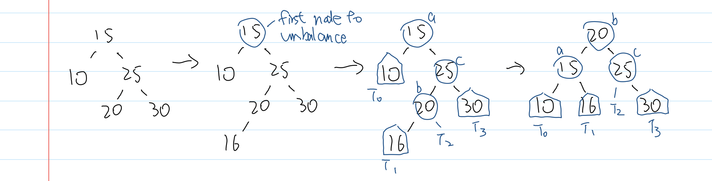
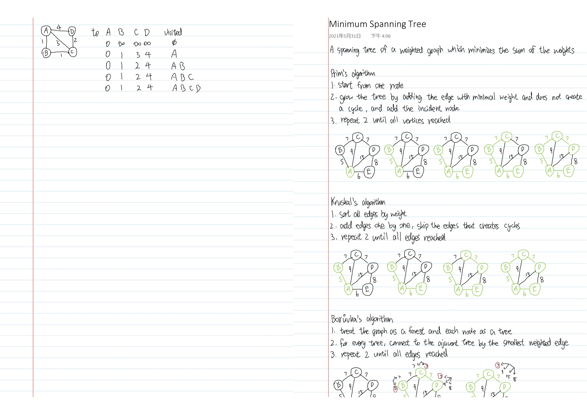

# complexity-of-algorithms-notes
Notes for the complexity of algorithms

### Contents

* Asymptotic Notation
* Tree Traversal
* Binary Search Tree
* AVL Tree
* (2, 4) Tree
* Heap
* Divide and Conquer
* Graphs
* Minimum Spanning Tree
* Flow Network
* Bipartite Matching
* Number Theory
* Cryptography
* NP Completeness

### Files

`Complexity of Algorithms Notes.pdf` Notes in PDF format

`Complexity of Algorithms Notes Booklet.pdf` Notes in PDF format; rearranged so that it can be printed into a booklet (left-binding, flips on the short edge)

